# Pulu-hardware

All information of the hardware in the pulu project from Projectwerk Vives is found here.  

## Hardware group

* Dylan Missuwe  
* Timon Claerhout  
* Seppe De Witte  
* Thybris Vandenbroucke  
* Aaron Degroote  

## Table of Contents

1. [Introduction](#Introduction)

2. [PCB](#PCB)  

3. [Schematic](#Schematic)  

4. [Features](#Features)

    4.1 [Microcontroller](#Microcontroller)  
        4.1.1 [Properties](#µC_Properties)  
        4.1.2 [Pinout](#µC_Pinout)  
        4.1.3 [Pinout Table](#µC_Pinout-table)  
    4.2 [Lora chip](#Lora-chip)  
        4.2.1 [Properties](#Lora_Properties)  
        4.2.2 [Pinout](#Lora_Pinout)  
        4.2.3 [Pinout Table](#Lora_Pinout-table)  
    4.3 [Crypto chip](#Crypto-chip)  
        4.3.1 [Properties](#Crypto_Properties)  
        4.3.2 [Pinout](#Crypto_Pinout)  
        4.3.3 [Pinout Table](#Crypto_Pinout-table)  
    4.4 [Moisture sensor](#Moisture-sensor)  
        4.4.1 [Properties](#Moisture_Properties)  
        4.4.2 [Pinout](#Moisture_Pinout)  
        4.4.3 [Pinout Table](#Moisture_Pinout-table)  
        4.4.4 [Moisture driver](#Moisture-driver)  
    4.5 [Temperture sensor](#Temperature-sensor)  
        4.5.1 [Properties](#Temperature_Properties)  
        4.5.2 [Pinout](#Temperature_Pinout)  
        4.5.3 [Pinout Table](#Temperature_Pinout-table)  
        4.5.4 [Moisture driver](#Temperature-driver)  
    4.6 [Light sensor](#Light-sensor)  
    4.7 [Other](#Other)  

5. [Case PCB](#Case-PCB)

## Introduction

All students of Elektronica-ICT had the assignment to work together on a project for the course Projectwerk of Vives Brugge.  

Belgium is the most affected by extreme drought in Europe so we build a project on that subject.  
We had to measure water contents indirectly by using capacitance sensors and send that data to an application so we can see those values. We have to do all this with using as little energy as possible.  

To manage this huge project we split up in 4 groups:  

* hardware  
* software  
* devops  
* firmware  

## PCB

| Front | Back |
|---|---|
|In this picture you can see the front of the PCB|In this picture you can see the back of the PCB|
|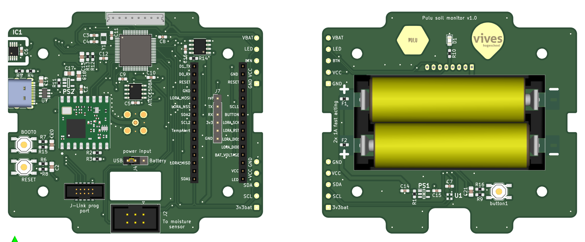 | 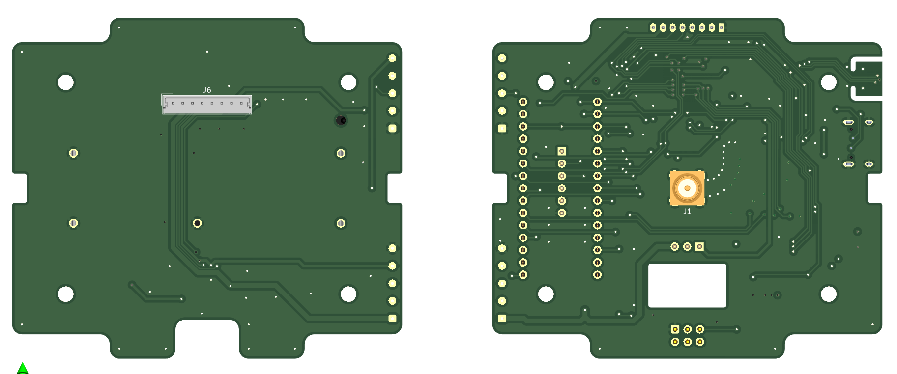 |

This is our main PCB we produced for the pulu project. It recieves his data with I2C communication of all the sensors and transmits it with the Lora module.  

### Schematic

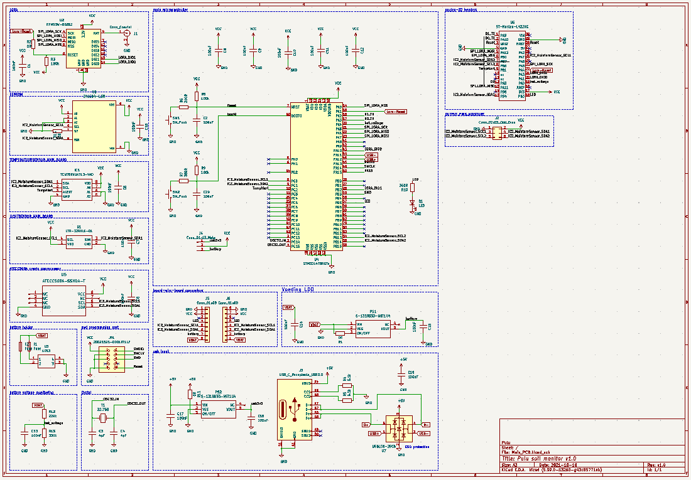  

This is the schematic of the main PCB we will explain all components here below.  

You can find the repository of the KiCAD files here:
[Microcontroller PCB](https://github.com/vives-projectwerk-2021/Microcontroller_pcb)

## Features

### Microcontroller

The microcontroller we use is the [STM32L476RG](https://pdf1.alldatasheet.com/datasheet-pdf/view/929993/STMICROELECTRONICS/STM32L476RG.html).  

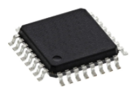

We chose this microcontroller because its ultralow power with FlexPowerControl and has all the features we need as described below.

#### µC_Properties

Memory µC

```text
Up to 1 MB Flash, 2 banks read-while-write,proprietary code readout protection.

Up to 128 KB of SRAM including 32 KB with hardware parity check.

External memory interface for static memories supporting SRAM, PSRAM, NOR and NAND memories.

Quad SPI memory interface.
```

Rich analog peripherals (independent supply)

```text
3x 12-bit ADC 5 Msps, up to 16-bit with hardware oversampling, 200 μA/Msps

2x 12-bit DAC output channels, low-power sample and hold

2x operational amplifiers with built-in PGA

2x ultra-low-power comparators
```

20x communication interfaces

```text
USB OTG 2.0 full-speed, LPM and BCD

2x SAIs (serial audio interface)

3x I2C FM+(1 Mbit/s), SMBus/PMBus

5x USARTs (ISO 7816, LIN, IrDA, modem)

1x LPUART (Stop 2 wake-up)

3x SPIs (and 1x Quad SPI)

CAN (2.0B Active) and SDMMC interface

SWPMI single wire protocol master I/F

IRTIM (Infrared interface)
```

Other Features

```text
14-channel DMA controller

True random number generator

CRC calculation unit, 96-bit unique ID

RTC with HW calendar, alarms and calibration

LCD 8× 40 or 4× 44 with step-up converter

Up to 24 capacitive sensing channels: support touchkey, linear and rotary touch sensors
```

#### µC_Pinout

| Pinout |
|---|---|
|In this picture you can see the pinout of the schematic |In this picture you can see the pinout of the datasheet|
|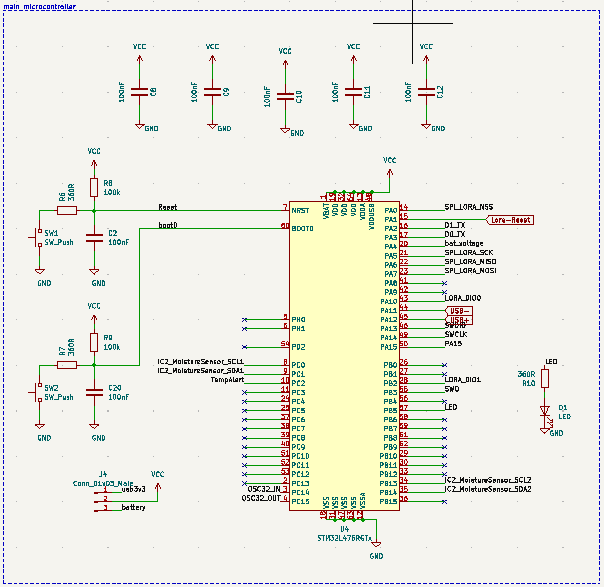 | 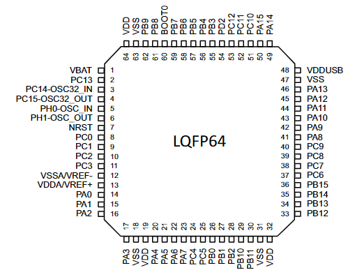 |

#### µC_Pinout-table

| Pinout table|
|:---|:---|:---|:---|
| Pin number | Pin name | Pin type | function |
| 1 | VBAT | S | I/O | Voltage of battery |
| 19 | VDD | S | Power for µC |
| 32 | VDD | S | Power for µC |
| 64 | VDD | S | Power for µC |
| 13 | VDDA | S | Power for µC |
| 48 | VDDUSB | S | Power of USB |
| 7 | NRST | I/O | Reset µC if pin set low |
| 60 | BOOT0 | I/O | Set pin low for programming µC |
| 8 | PC0 | I/O | Clock1 input of crypto |
| 9 | PC1 | I/O | Data1 input of crypto |
| 10 | PC2 | I/O | Alert pin if temperature is to high |
| 3 | PC14 | I/O | Input pin of crystal |
| 4 | PC15 | I/O | Output pin of crystal |
| 14 | PA0 | I/O | SPI chip select of lora chip|
| 15 | PA1 | I/O | Reset pin of lora chip |
| 16 | PA2 | I/O | Transmit pin of D1 |
| 17 | PA3 | I/O | Transmit pin of D0 |
| 20 | PA4 | I/O | Voltage of battery |
| 21 | PA5 | I/O | SPI clock input of lora chip |
| 22 | PA6 | I/O | SPI data output of lora chip |
| 23 | PA7 | I/O | SPI data input of lora chip |
| 43 | PA10 | I/O | DIO0 of lora chip for feedback |
| 44 | PA11 | I/O | negative pin of USB |
| 45 | PA12 | I/O | positive pin of USB |
| 46 | PA13 | I/O | SWDIO |
| 49 | PA14 | I/O | SWCLK |
| 50 | PA15 | I/O | PA15 to Nucleo chip |
| 28 | PB2 | I/O | DIO1 of lora chip for feedback |
| 55 | PB3 | I/O | SWO |
| 57 | PB5 | I/O | Provides power to LED |
| 34 | PB13 | I/O | CLock2 pin for I2C |
| 35 | PB14 | I/O | Data2 pin for I2C |
| 18 | VSS | S | GND of µC |
| 31 | VSS | S | GND of µC |
| 47 | VSS | S | GND of µC |
| 63 | VSS | S | GND of µC |
| 12 | VSSA | S | GND of µC |

### Lora-chip

In order to transmit the data without using mush power we use LoRaWAN.  
We are using the [RFM95W](https://www.rfsolutions.co.uk/downloads/1463993415RFM95_96_97_98W.pdf) lora chip for that.  

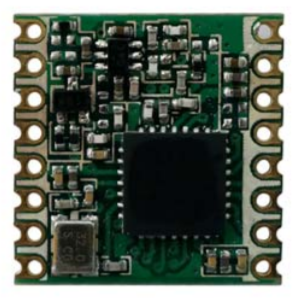

We picked this chip because its compact, doesn't use much power and has all the features we need as described below.

#### Lora_Properties

Range

```text
168 dB maximum link budget.

+20 dBm - 100 mW constant RF output vs. V supply.

+14 dBm high efficiency PA.

127 dB Dynamic Range RSSI.
```

Other  

```text
Programmable bit rate up to 300 kbps.

High sensitivity: down to -148 dBm.

Bullet-proof front end: IIP3 = -12.5 dBm.

Low RX current of 10.3 mA, 200 nA register retention.

Fully integrated synthesizer with a resolution of 61 Hz.

FSK, GFSK, MSK, GMSK, LoRaTM and OOK modulation.

Built-in bit synchronizer for clock recovery.

Packet engine up to 256 bytes with CRC.

Built-in temperature sensor and low battery indicator.
```

#### Lora_Pinout

| Pinout |
|---|---|
|In this picture you can see the pinout of the schematic |In this picture you can see the pinout of the datasheet|
|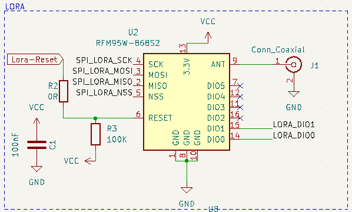 | 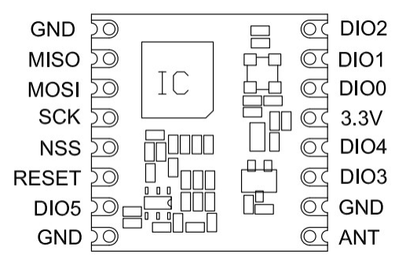 |

#### Lora_Pinout-table

| Pinout table|
|---|---|---|---|
| Pin number | Pin name | Pin type | function |
| 1 | GND | S | Ground |
| 2 | MISO | I | SPI Data output |
| 3 | MOSI | O | SPI Data input |
| 4 | SCK | I | SPI Clock input |
| 5 | NSS | I | SPI Chip select input |
| 6 | RESET | I/O | Reset trigger input |
| 8 | GND | S | Ground |
| 9 | ANT | S | RF signal output/input. |
| 10 | GND | S | Ground |
| 13 | 3.3V | S | Supply voltage |
| 14 | DIO0 | I/O | Digital I/O, software configured |
| 15 | DIO1 | I/O | Digital I/O, software configured |

### Crypto-chip

We are using the [ATECC508A](https://www.tme.eu/Document/ec38f2d40df555909f34806db4bdb798/ATECC508A-DTE.pdf) crypto chip.  

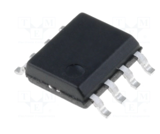

This is for encrypting our data so its much more secure to transmit and recieve.  

#### Crypto_Features

```text
SHA-256 Hash Algorithm with HMAC Option

256-bit Key Length

Storage for up to 16 Keys

Guaranteed Unique 72-bit Serial Number

Internal High-quality FIPS Random Number Generator (RNG)

10Kb EEPROM Memory for Keys, Certificates, and Data

Multiple I/O Options:
– High-speed Single Pin Interface, with One GPIO Pin
– 1MHz Standard I2C Interface

2.0V to 5.5V Supply Voltage Range

1.8V to 5.5V IO levels

<150nA Sleep Current 
```

#### Crypto_pinout

| Pinout |
|---|---|
|In this picture you can see the pinout of the schematic |In this picture you can see the pinout of the datasheet|
|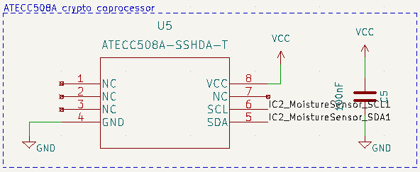 | 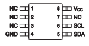 |

#### Crypto_pinout-table

| Pinout table|
|---|---|---|---|
| Pin number | Pin name | Pin type | function |
| 1 | NC | S | Normal closed |
| 2 | NC | S | Normal closed |
| 3 | NC | S | Normal closed |
| 4 | GND | S | Ground connection |
| 5 | SDA | I/O | Data pin of I2C |
| 6 | SCL | I/O | Clock pin of I2C |
| 7 | NC | S | Normal closed |
| 8 | VCC | S | Power supply of chip|

### Moisture-sensor

To measure the water contents in the ground we use moisture sensors.  
We provided copper tapes every 25 cm by the sensor so we can see the capacitance on 4 different depths inside the PCB tube.  

We are using the [FDC1004](https://www.ti.com/lit/ds/symlink/fdc1004.pdf?HQS=dis-dk-null-digikeymode-dsf-pf-null-wwe&ts=1638778262131&ref_url=https%253A%252F%252Fwww.ti.com%252Fgeneral%252Fdocs%252Fsuppproductinfo.tsp%253FdistId%253D10%2526gotoUrl%253Dhttps%253A%252F%252Fwww.ti.com%252Flit%252Fgpn%252Ffdc1004) moisture sensor:  

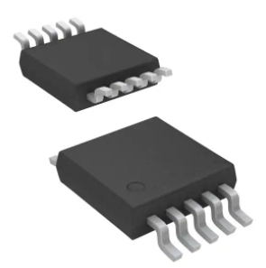

Because this is a 4 channel capacitance to digital converter (so we can measure on 4 different depths).  
Each channel has a full-scale range of ±15pF and can handle a sensor offset capacitance of up to 100pF.  

#### Moisture_properties

```text
Input Range: ±15 pF

Maximum Offset Capacitance: 100 pF

Programmable Output Rates: 100/200/400 S/s

Maximum Shield Load: 400 pF

Supply Voltage: 3.3 V

Temp Range: –40° to 125°C

Current Consumption:
– Active: 750 µA
– Standby: 29 µA
```

#### Moisture_pinout

| Pinout |
|---|---|
|In this picture you can see the pinout of the schematic |In this picture you can see the pinout of the datasheet|
|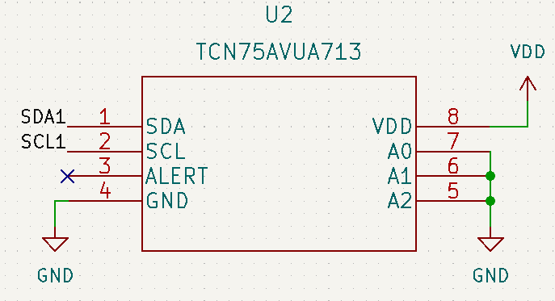 | 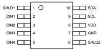 |

#### Moisture_pinout-table

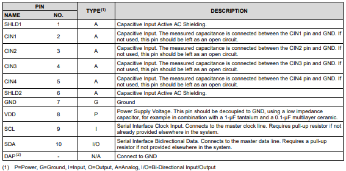

#### Moisture-driver

We have also written a library of the moisture sensor which can be found here:
[Moisture sensor driver](https://github.com/vives-projectwerk-2021/pulu-moisture-sensor.git)

### Temperature-sensor

To measure the temperature we are using the [TCN75AVOA713](https://www.mouser.be/datasheet/2/268/21935C-70836.pdf) sensor.  

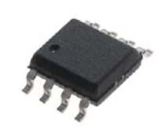

#### Temperature_properties

```text
Temperature-to-Digital Converter

Accuracy:
- ±1 (typ.) from -40°C to +125°C
- ±2°C (max.) from +40°C to +125°C

User-selectable Resolution: 0.5°C to 0.0625°C

Operating Voltage Range: 2.7V to 5.5V

2-wire Interface: I2C™ Compatible

Operating Current: 200 μA (typ.)
Shutdown Current: 2 μA (max.)
```

#### Temperature_pinout

| Pinout |
|---|---|
|In this picture you can see the pinout of the schematic |In this picture you can see the pinout of the datasheet|
|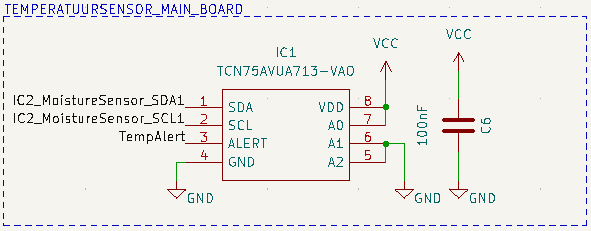 | 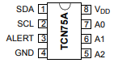 |

#### Temperature_pinout-table

| Pinout table|
|---|---|---|---|
| Pin number | Pin name | Pin type | function |
| 1 | SDA | I/O | Data pin of I2C |
| 2 | SCL | I | Clock pin of I2C |
| 3 | ALERT | O | If temperature goes above range |
| 4 | GND | S | GND connection of chip |
| 5 | A2 | I | Slave address input pin |
| 6 | A1 | I | Slave address input pin |
| 7 | A0 | I | Slave address input pin |
| 8 | VDD | S | VDD connection of chip |

#### Temperature-driver

We have also written a library of the temperature sensor which can be found here:
[Temperature sensor driver](https://github.com/vives-projectwerk-2021/pulu-temperature-sensor.git)

### Light-sensor

To measure the light we are using the [LTR329als01](https://www.mouser.com/datasheet/2/239/Lite-On_LTR-329ALS-01%20DS_ver1.1-348647.pdf) lux sensor.  

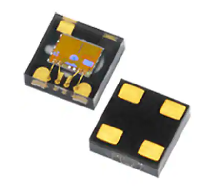

The sensor can measure light from 0.01 lux to 64k lux with an 16-bit effective resolution.  
It also consumes not much power:

* Operating Current: 220 µA
* Standby Current: 5 µA

We have also written a library of the light sensor which can be found here:
[Light sensor driver](https://github.com/vives-projectwerk-2021/lightSensorDriver.git)

### Other

The PCB has other functions such as:

* USB-C connection with ESD protection
* AA Battery voltage monitoring
* EEPROM (24LC64-I_SN) for storing data
* LED for testing out communication PCB

### Case-PCB

To make sure our PCB stays waterproof we are using a PVC tube with a glass lid at the top.  
That can be opened with screws.  
At the bottom of the PCB tube is a 3D printed spike that fits perfectly in the tube and is connected with glue. So we can put the tube much easier in the ground.  
Here is a sensor that we planted outside school:  

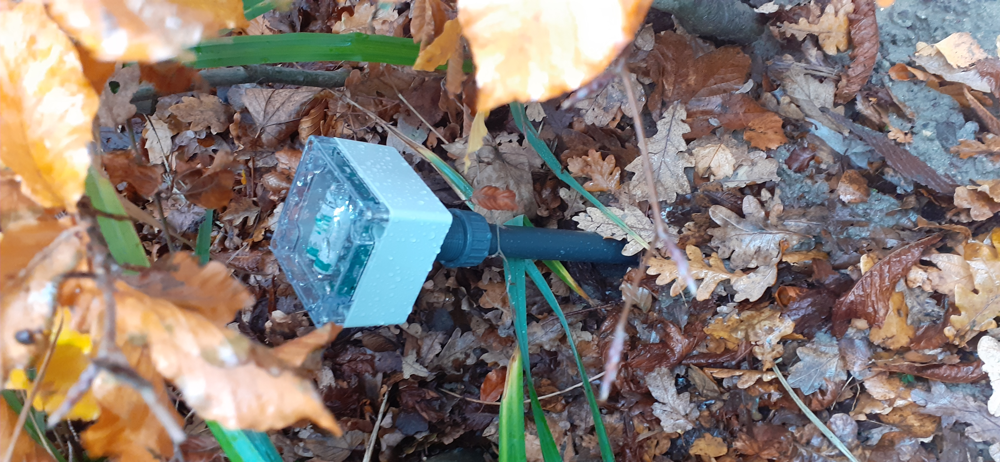  
