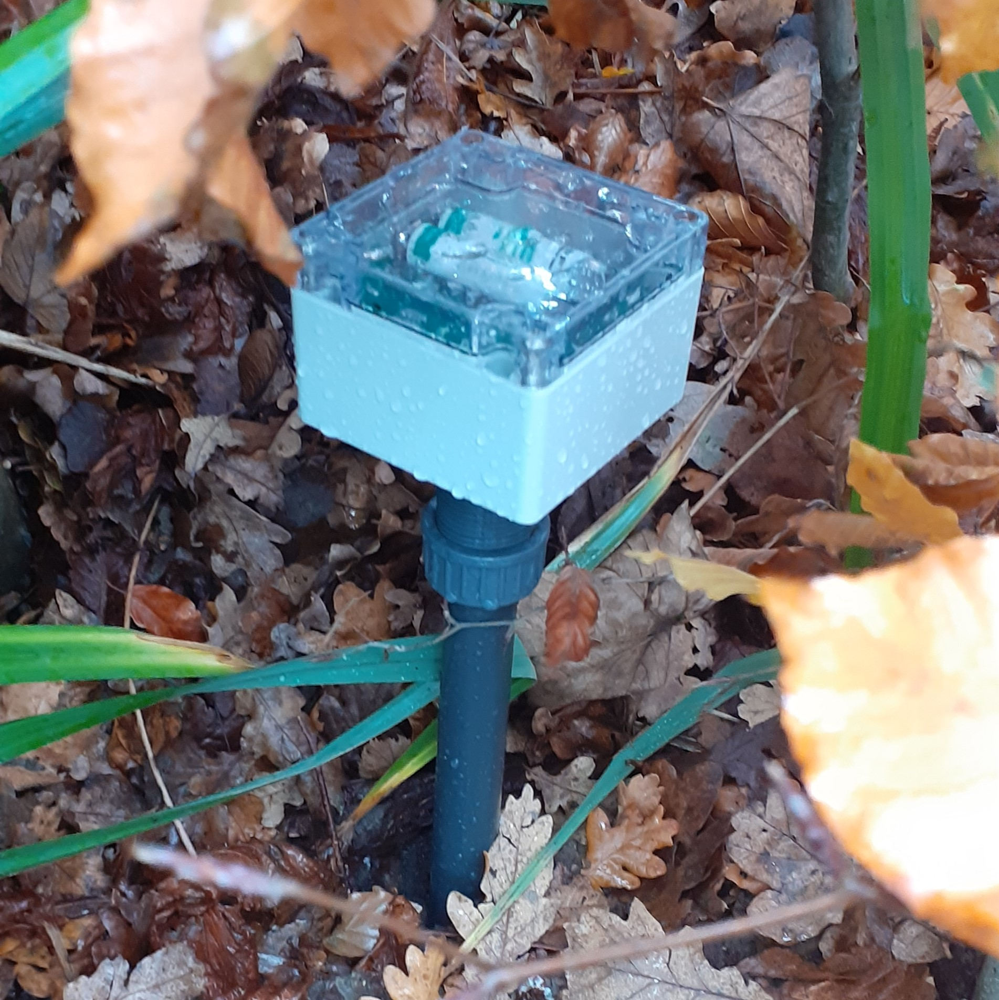

# Pulu-hardware

All information of the hardware of the pulu project from Projectwerk Vives is found here.  

## Hardware group

* Dylan Missuwe  
* Timon Claerhout  
* Seppe De Witte  
* Thybris Vandenbroucke  
* Aaron Degroote  

## Intro

All students of Elektronica-ICT had the assignment to work together on a project for the course Projectwerk of Vives Brugge.  

Belgium is the most affected by extreme drought in Europe so we build a project on that subject.  
We had to measure water contents indirectly by using capacitance sensors and send that data to an application so we can see those values. We have to do all this with using as little energy as possible.  

To manage this huge project we split up in 4 groups:  

* hardware  
* software  
* devops  
* firmware  

## PCB

| Front | Back |
|---|---|
|  |  |

### Schematic

  

Repository with KiCAD files:
[Microcontroller PCB](https://github.com/vives-projectwerk-2021/Microcontroller_pcb)

## Features

### Microcontroller

The microcontroller we use is the STM32L476RG. We chose this microcontroller because its
ultralow power with FlexPowerControl and has all the features we need such as:

___

Memory µC

```text
Up to 1 MB Flash, 2 banks read-while-write,proprietary code readout protection.

Up to 128 KB of SRAM including 32 KB with hardware parity check.

External memory interface for static memories supporting SRAM, PSRAM, NOR and NAND memories.

Quad SPI memory interface.
```

Rich analog peripherals (independent supply)

```text
3x 12-bit ADC 5 Msps, up to 16-bit with hardware oversampling, 200 μA/Msps

2x 12-bit DAC output channels, low-power sample and hold

2x operational amplifiers with built-in PGA

2x ultra-low-power comparators
```

20x communication interfaces

```text
USB OTG 2.0 full-speed, LPM and BCD

2x SAIs (serial audio interface)

3x I2C FM+(1 Mbit/s), SMBus/PMBus

5x USARTs (ISO 7816, LIN, IrDA, modem)

1x LPUART (Stop 2 wake-up)

3x SPIs (and 1x Quad SPI)

CAN (2.0B Active) and SDMMC interface

SWPMI single wire protocol master I/F

IRTIM (Infrared interface)
```

Other Features

```text
14-channel DMA controller

True random number generator

CRC calculation unit, 96-bit unique ID

RTC with HW calendar, alarms and calibration

LCD 8× 40 or 4× 44 with step-up converter

Up to 24 capacitive sensing channels: support touchkey, linear and rotary touch sensors
```


### Lora chip

In order to transmit the data without using mush power we use LoRaWAN.  
We are using the [RFM95W](https://www.rfsolutions.co.uk/downloads/1463993415RFM95_96_97_98W.pdf) lora chip for that:  


We picked this chip because its compact and doesn't use much power.  
It has an RX current of 10.3 mA, 200 nA register retention.  
For reading and writing the sensors we're using I2C communication.  

### Crypto chip

We are using the [ATECC508A](https://www.tme.eu/Document/ec38f2d40df555909f34806db4bdb798/ATECC508A-DTE.pdf) crypto chip.  


This is for encrypting our data so its much more secure to transmit and recieve.  
He uses an SHA-256 Hash Algorithm with HMAC Option that provides an 256-bit key length.  

The chip can store up to 16 keys.  

It also doens't need much power, in sleep current: <150 nA.  

### Moisture sensor

To measure the water contents in the ground we use moisture sensors.  
We provided copper tapes every 25 cm by the sensor so we can see the capacitance on 4 different depths inside the PCB tube.  

We are using the [FDC1004](https://www.ti.com/lit/ds/symlink/fdc1004.pdf?HQS=dis-dk-null-digikeymode-dsf-pf-null-wwe&ts=1638778262131&ref_url=https%253A%252F%252Fwww.ti.com%252Fgeneral%252Fdocs%252Fsuppproductinfo.tsp%253FdistId%253D10%2526gotoUrl%253Dhttps%253A%252F%252Fwww.ti.com%252Flit%252Fgpn%252Ffdc1004) moisture sensor:  


Because this is a 4 channel capacitance to digital converter (so we can measure on 4 different depths).  
Each channel has a full-scale range of ±15pF and can handle a sensor offset capacitance of up to 100pF.  
It also doesn't need much power:

* Active mode: 750 µA
* Standby mode: 29 µA

We have also written a library of the moisture sensor which can be found here:
[Moisture sensor driver](https://github.com/vives-projectwerk-2021/pulu-moisture-sensor.git)

### Temperature sensor

To measure the temperature we are using the [TCN75AVOA713](https://www.mouser.be/datasheet/2/268/21935C-70836.pdf) sensor.  


The sensor can measure temperatures from -40 °C to 125 °C with an 1 °C accuracy.  
It also consumes not much power:

* Operating Current: 200 µA (typical)
* Shutdown Current: 2 µA (maximum)

We have also written a library of the temperature sensor which can be found here:
[Temperature sensor driver](https://github.com/vives-projectwerk-2021/pulu-temperature-sensor.git)

### Light sensor

To measure the light we are using the [LTR329als01](https://www.mouser.com/datasheet/2/239/Lite-On_LTR-329ALS-01%20DS_ver1.1-348647.pdf) lux sensor.  


The sensor can measure light from 0.01 lux to 64k lux with an 16-bit effective resolution.  
It also consumes not much power:

* Operating Current: 220 µA
* Standby Current: 5 µA

We have also written a library of the light sensor which can be found here:
[Light sensor driver](https://github.com/vives-projectwerk-2021/lightSensorDriver.git)

### Other

The PCB has other functions such as:

* USB-C connection with ESD protection
* AA Battery voltage monitoring
* EEPROM (24LC64-I_SN) for storing data
* LED for testing out communication PCB

### Case for PCB

To make sure our PCB stays waterproof we are using a PVC tube with a glass lid at the top.  
That can be opened with screws.  
At the bottom of the PCB tube is a 3D printed spike that fits perfectly in the tube and is connected with glue. So we can put the tube much easier in the ground.  
Here is a sensor that we planted outside school:  

  
