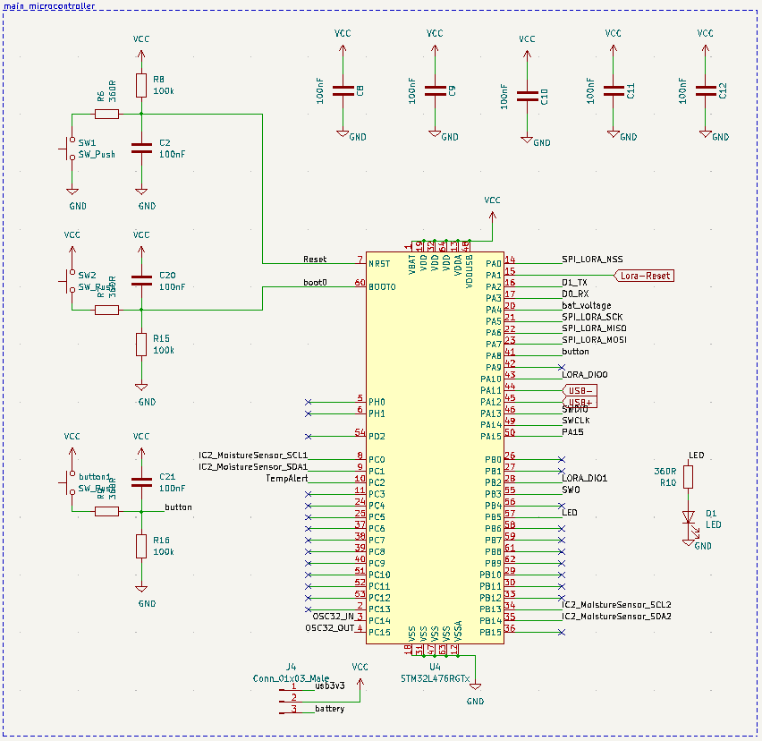
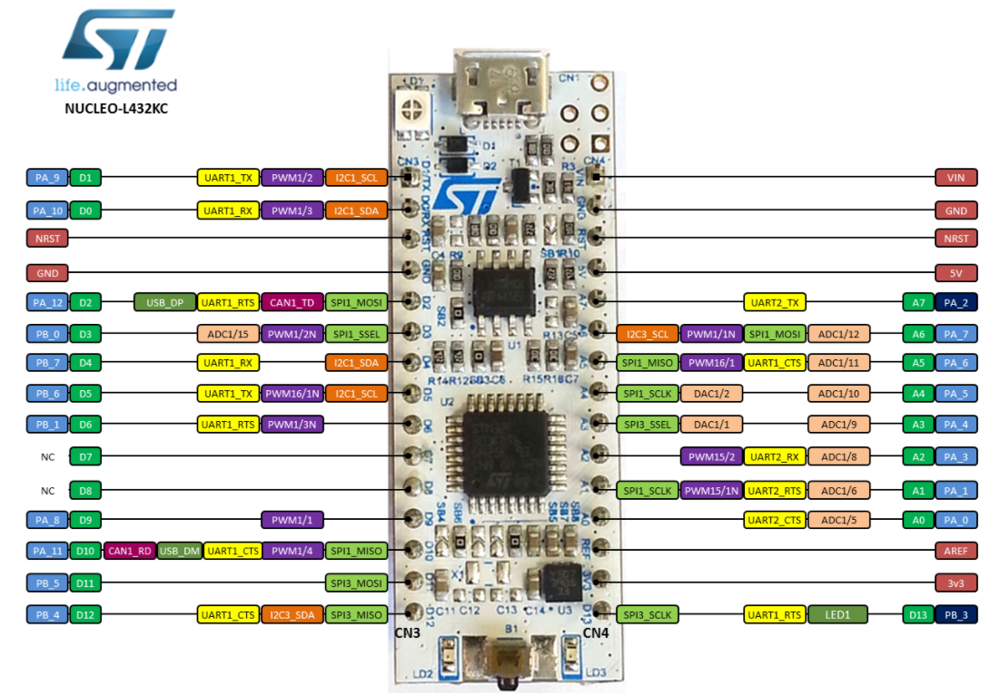
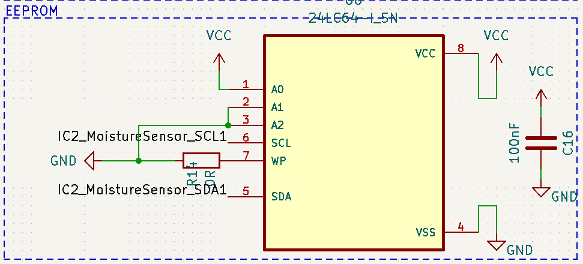

# Pulu-hardware

All information of the hardware in the pulu project from Projectwerk Vives is found here.  

## Hardware group

* Dylan Missuwe  
* Timon Claerhout  
* Seppe De Witte  
* Thybris Vandenbroucke  
* Aaron Degroote  

## Table of Contents

1. [Introduction](#Introduction)

2. [PCB](#PCB)  

3. [Schematic](#Schematic)  

4. [Features](#Features)

    * [Microcontroller](#Microcontroller)  
        1. [Properties](#µC_Properties)  
        2. [Pinout](#µC_Pinout)  
        3. [Pinout Table](#µC_Pinout-table)  
    * [Battery holder](#Batteryholder)  
        1. [Pinout](#Batteryholder_Pinout)  
        2. [Pinout Table](#Batteryholder_Pinout-table)  
    * [LDO](#LDO)  
        1. [Pinout](#LDO_Pinout)  
        2. [Pinout Table](#LDO_Pinout-table)  
    * [USB-C](#USB-C)  
        1. [Pinout](#USB-C_Pinout)  
        2. [Pinout Table](#USB-C_Pinout-table)  
    * [SWD](#SWD)  
        1. [Pinout](#SWD_Pinout)  
        2. [Pinout Table](#SWD_Pinout-table)  
    * [UART](#UART)  
        1. [Pinout](#SWD_Pinout)  
        2. [Pinout Table](#SWD_Pinout-table)  
    * [Nucleo](#Nucleo)  
        1. [Properties](#Nucleo_Properties)  
        2. [Pinout](#Nucleo_Pinout)  
        3. [Pinout Table](#Nucleo_Pinout-table)  
    * [Lora chip](#Lora-chip)  
        1. [Properties](#Lora_Properties)  
        2. [Pinout](#Lora_Pinout)  
        3. [Pinout Table](#Lora_Pinout-table)  
    * [Crypto chip](#Crypto-chip)  
        1. [Properties](#Crypto_Properties)  
        2. [Pinout](#Crypto_Pinout)  
        3. [Pinout Table](#Crypto_Pinout-table)  
    * [Moisture sensor](#Moisture-sensor)  
        1. [Properties](#Moisture_Properties)  
        2. [Pinout](#Moisture_Pinout)  
        3. [Pinout Table](#Moisture_Pinout-table)  
        4. [Moisture driver](#Moisture-driver)  
    * [Moisture output](#Moisture_output)  
        1. [Pinout](#Moisture_out_Pinout)  
        2. [Pinout Table](#Moisture_out_Pinout-table)  
    * [Temperture sensor](#Temperature-sensor)  
        1. [Properties](#Temperature_Properties)  
        2. [Pinout](#Temperature_Pinout)  
        3. [Pinout Table](#Temperature_Pinout-table)  
        4. [Temperature driver](#Temperature-driver)  
    * [Light sensor](#Light-sensor)  
        1. [Properties](#Light_Properties)  
        2. [Pinout](#Light_Pinout)  
        3. [Pinout Table](#Light_Pinout-table)  
        4. [Light driver](#Light-driver)  
    * [EEPROM memory](#EEPROM)  
        1. [Properties](#EEPROM_Properties)  
        2. [Pinout](#EEPROM_Pinout)  
        3. [Pinout Table](#EEPROM_Pinout-table)  
    * [Board connection](#Board_connection)  
        1. [Pinout](#Board_connection_Pinout)  
        2. [Pinout Table](#Board_connection_Pinout-table)  

5. [Case PCB](#Case-PCB)

## Introduction

All students of Elektronica-ICT had the assignment to work together on a project for the course Projectwerk of Vives Brugge.  

Belgium is the most affected by extreme drought in Europe so we build a project on that subject.  
We had to measure water contents indirectly by using capacitance sensors and send that data to an application so we can see those values. We have to do all this with using as little energy as possible.  

To manage this huge project we split up in 4 groups:  

* hardware  
* software  
* devops  
* firmware  

## PCB

| Front | Back |
|---|---|
| In this picture you can see the front of the PCB | In this picture you can see the back of the PCB |
|  |  |

This is our main PCB we produced for the pulu project. It recieves his data with I2C communication of all the sensors and transmits it with the Lora module.  

## Schematic

  

This is the schematic of the main PCB we will explain all components here below.  
We use 0805 size for all SMD resistors, capacitors, etc.  

You can find the repository of the KiCAD files here:
[Microcontroller PCB](https://github.com/vives-projectwerk-2021/Microcontroller_pcb)

## Features

### Microcontroller

The microcontroller we use is the [STM32L476RG](https://pdf1.alldatasheet.com/datasheet-pdf/view/929993/STMICROELECTRONICS/STM32L476RG.html).  


We chose this microcontroller because its ultralow power with FlexPowerControl and has all the features we need as described below.

#### µC_Properties

Memory µC

```text
Up to 1 MB Flash, 2 banks read-while-write,proprietary code readout protection.

Up to 128 KB of SRAM including 32 KB with hardware parity check.

External memory interface for static memories supporting SRAM, PSRAM, NOR and NAND memories.

Quad SPI memory interface.
```

Rich analog peripherals (independent supply)

```text
3x 12-bit ADC 5 Msps, up to 16-bit with hardware oversampling, 200 μA/Msps

2x 12-bit DAC output channels, low-power sample and hold

2x operational amplifiers with built-in PGA

2x ultra-low-power comparators
```

20x communication interfaces

```text
USB OTG 2.0 full-speed, LPM and BCD

2x SAIs (serial audio interface)

3x I2C FM+(1 Mbit/s), SMBus/PMBus

5x USARTs (ISO 7816, LIN, IrDA, modem)

1x LPUART (Stop 2 wake-up)

3x SPIs (and 1x Quad SPI)

CAN (2.0B Active) and SDMMC interface

SWPMI single wire protocol master I/F

IRTIM (Infrared interface)
```

Other Features

```text
14-channel DMA controller

True random number generator

CRC calculation unit, 96-bit unique ID

RTC with HW calendar, alarms and calibration

LCD 8× 40 or 4× 44 with step-up converter

Up to 24 capacitive sensing channels: support touchkey, linear and rotary touch sensors
```

#### µC_Pinout

| Pinout of schematic | Pinout of datasheet |
|---|---|
|  |  |

**NRST pin:**  
The NRST pin is used to exit stanby mode or to fix most of the common failures (unexpected reset and program counter corruption) of the chip.  
We have to pull the pin low for that, by pressing on the connected switch.  

**Boot0:**  
The BOOT0 pin is used to select one of three boot options:  
• Boot from user Flash  
• Boot from system memory  
• Boot from embedded SRAM  
The boot loader is located in system memory.  
It is used to reprogram the Flash memory by using I2C in Device mode through DFU (device firmware upgrade).  

**Capacitors:**  
We are using the capacitors that are connected to VCC and/or GND as [decouple capacitors](https://en.wikipedia.org/wiki/Decoupling_capacitor).  
This is to reduce the voltage spikes of the power supply.  
So we ensure a stable supply without chance of damage to the components.  

**Resistors:**  
We are using the resistors that are connected to VCC and/or GND and by the [switches](https://sten-eswitch-13110800-production.s3.amazonaws.com/system/asset/product_line/data_sheet/165/TL3342.pdf) as [pull-up/pull-down resistor](https://en.wikipedia.org/wiki/Pull-up_resistor).  
This is to ensure a known state for a signal (0/1) when the switch is opened or closed.  
So don't get false values.  

We are using the resitor by the LED as [ballast resistor](https://eepower.com/resistor-guide/resistor-applications/resistor-for-led/#).  
This is used to limit the current through the LED and to prevent excess current that can burn out the LED.  
We are using 360 Ohm resistor to ensure the LED can glow up nicely.  
You can calculate the resistor yourself by using this formula: R = (V-Vled)/I  
Where V is the voltage source, VLED is the LED voltage, and I is the LED current.  

**Crystal**
In order to create a constant frequency for the µC we're using a [crystal](https://en.wikipedia.org/wiki/Crystal_oscillator) because it generates oscillations on a certain frequency.  
There are also 2 capacitors connected as you can see at the schematic.  
Those are [load capacitors](https://www.iqdfrequencyproducts.com/blog/2020/08/03/myths-around-load-capacitance-how-to-choose-the-right-capacitors/) and this is for a guaranteed precision of the crystal.

  

**Connector**
You can see a 3 pin male header at the bottom of the schematic.  
This is for switching the power source with a jumper.  
We can choose to either power the circuit with the voltage of the USB connector or the battery.

#### µC_Pinout-table

| Pin number | Pin name | Pin type | function |
| --- | --- | --- | --- |
| 1 | VBAT | S | I/O | Voltage of battery |
| 19 | VDD | S | Power for µC |
| 32 | VDD | S | Power for µC |
| 64 | VDD | S | Power for µC |
| 13 | VDDA | S | Power for µC |
| 48 | VDDUSB | S | Power of USB |
| 7 | NRST | I/O | Reset µC if pin set low |
| 60 | BOOT0 | I/O | Set pin low for programming µC |
| 8 | PC0 | I | Clock1 input of crypto |
| 9 | PC1 | O | Data1 output of crypto |
| 10 | PC2 | I/O | Alert pin if temperature is to high |
| 3 | PC14 | I | Input pin of crystal |
| 4 | PC15 | O | Output pin of crystal |
| 14 | PA0 | I | SPI chip select of lora chip|
| 15 | PA1 | I | Reset pin of lora chip |
| 16 | PA2 | I/O | Transmit pin of D1 |
| 17 | PA3 | I/O | Transmit pin of D0 |
| 20 | PA4 | I/O | Voltage of battery |
| 21 | PA5 | I | SPI clock input of lora chip |
| 22 | PA6 | O | SPI data output of lora chip |
| 23 | PA7 | I | SPI data input of lora chip |
| 43 | PA10 | I/O | DIO0 of lora chip for feedback |
| 44 | PA11 | I/O | negative pin of USB |
| 45 | PA12 | I/O | positive pin of USB |
| 46 | PA13 | I/O | SWDIO |
| 49 | PA14 | I | SWCLK |
| 50 | PA15 | I/O | PA15 to Nucleo chip |
| 28 | PB2 | I/O | DIO1 of lora chip for feedback |
| 55 | PB3 | I/O | SWO |
| 57 | PB5 | O | Provides power to LED |
| 34 | PB13 | I | CLock2 pin for I2C |
| 35 | PB14 | O | Data2 pin for I2C |
| 18 | VSS | S | GND of µC |
| 31 | VSS | S | GND of µC |
| 47 | VSS | S | GND of µC |
| 63 | VSS | S | GND of µC |
| 12 | VSSA | S | GND of µC |

### Batteryholder

We're using a battery holder that can hold 2x AA batteries to provide power for our PCB without other adapters.  


We are using Saft LS14500 AA batteries because those are nickel-based batteries.  
They work in extreme temperatures and last longer than other batteries, making them the preferred choice for backup power in industry, PCB, etc.  

We are using a [LDO](#LDO) to expand the life time and performance of the battery.  

#### Batteryholder_Pinout

| Pinout of schematic | Pinout of datasheet |
|---|---|
| |  |

There are 2 [fuses](https://en.wikipedia.org/wiki/Fuse_(electrical)) by the battery holder for protecting the circuit.  
A fuse is an electrical safety device that operates to provide overcurrent protection of an electrical circuit. Its a metal wire or strip that melts when too much current flows through it, thereby stopping or interrupting the current.  

#### Batteryholder_Pinout-table

| Pin number | Pin name | Pin type | function |
|---|---|---|---|
| 1 | 1 | S | VCC+ pin |
| 2 | 2 | S | VCC+ pin |
| 3 | 3 | S | Ground |
| 4 | 4 | S | Ground |

#### Battery_voltage

We're using a [voltage divider](https://en.wikipedia.org/wiki/Voltage_divider) in order to monitor the battery voltage. Thereby we connect 2 resistors in serial and we measure the voltage in the middle as you can see on the schematic:  


### LDO

We are using the [TC1054](http://ww1.microchip.com/downloads/en/DeviceDoc/21350E.pdf)  


We're using this [Low-dropout regulator](https://en.wikipedia.org/wiki/Low-dropout_regulator) in order to expand the battery life time and performance of our circuit.  

#### LDO_Pinout

| Pinout of schematic | Pinout of datasheet |
|---|---|
| |  |

We used the components on the schematic that were recommomended from the datasheet.

#### LDO_Pinout-table

| Pin number | Pin name | Pin type | function |
| --- | --- | --- | --- |
| 1 | VIN | S | Unregulated supply input |
| 2 | GND | S | Ground terminal |
| 3 | SHDN | I | Shutdown control input |
| 4 | ERROR | O | Out-of-Regulation Flag (Open-drain output) |
| 5 | VOUT | O | Regulated voltage output |

### USB-C

We also provided an [USB-C](https://en.wikipedia.org/wiki/USB-C) connector to power the circuit. Which is ideal for programming and testing software out without wasting power of the batteries which can later be used in the fields.  

#### USB-C_Pinout

| Pinout of schematic |
|---|
|  |

We're connecting 2 resistor of 5.1k on the USB-C because it is recommended in the datasheet to provide a good working.  
You can see at the left of the schematic a voltage regulator because the voltage of the USB-C is 5V. But we need 3.3V for the circuit, so we implemented a regulator 5V-3.3V.  
At the right of the schematic is an [ESD-protection](https://en.wikipedia.org/wiki/Electrostatic_discharge) implemented. This is as safety so the components don't stop working after an electrostatic discharge.

#### USB-C_Pinout-table

| Pin number | Pin name | Pin type | function |
| --- | --- | --- | --- |
| 1 | VIN | S | Unregulated supply input |
| 2 | GND | S | Ground terminal |
| 3 | SHDN | I | Shutdown control input |
| 4 | ERROR | O | Out-of-Regulation Flag (Open-drain output) |
| 5 | VOUT | O | Regulated voltage output |

### SWD

In order to program and debug the Microcontroller we're using SWD or [Serial Wire Debug](https://www.silabs.com/documents/public/application-notes/an0062.pdf).  
Since SWD specializes in programming and debugging, it comes with many special features that is usually not available anywhere else like sending debug info to the computer via the IO line.  

#### SWD_Pinout

| Pinout of schematic | Pinout of datasheet |
|---|---|
| |  |

In SWD mode, two pins are used for debugging: one bi-directional pin (SWDIO) transfers the information and the second pin (SWDCLK) clocks the data. A third pin (SWO) delivers the trace data at minimum system cost. The Serial Wire and JTAG pins are shared.  

#### SWD_Pinout-table

| Pin number | Pin name | Pin type | function |
| --- | --- | --- | --- |
| 1 | VCC | S | Voltage pin |
| 2 | SWDIO | I/O | Data pin |
| 3 | GND | S | Ground terminal |
| 4 | SWCLK | I | Clock pin |
| 5 | GND | S | Ground terminal |
| 6 | SWO | O | Delivers trace data |
| 7 | NC | / | Not connected |
| 8 | NC | / | Not connected |
| 9 | GND | S | Ground terminal |
| 10 | RESET | O | Regulated voltage output |

### UART

We also provided an [UART](https://en.wikipedia.org/wiki/Universal_asynchronous_receiver-transmitter) or Universal asynchronous receiver-transmitter connection to also program and debug the PCB.  
A UART is usually an individual (or part of an) integrated circuit (IC) used for serial communications over a computer or peripheral device serial port. One or more UART peripherals are commonly integrated in microcontroller chips. Specialised UARTs are used for automobiles, smart cards and SIMs.  

#### UART_Pinout

| Pinout of schematic |
|---|
|  |

#### UART_Pinout-table

| Pin number | Pin name | Pin type | function |
| --- | --- | --- | --- |
| 1 | RESET | S | Reset pin |
| 2 | TX | I/O | Transmit pin |
| 3 | RX | S | Reciever pin |
| 4 | VCC | I | Voltage terminal |
| 5 | NC | S | Not connected |
| 6 | GND | O | Ground terminal |

### Nucleo

We're using the [STM32L432KC](https://www.st.com/en/microcontrollers-microprocessors/stm32l432kc.html) microcontroller.  
We use the same pins of that µC in our pin headers so we can plug them easily in and out.  

#### Nucleo_Properties

```text
STM32L432KC in UFQFPN32 package

ARM®32-bit Cortex®-M4 CPU

80 MHz max CPU frequency

VDD from 1.65 V to 3.6 V

256 KB Flash

64 KB SRAM

Timers General Purpose (4)

SPI/I2S (2)

I2C (2)

USART (2)

12-bit ADC with 10 channels (1)

GPIO (20) with external interrupt capability

RTC

Random Generator (TRNG for HW entropy)
```

#### Nucleo_Pinout

| Pinout of schematic |
|---|
|  |

#### Nucleo_Pinout-table




### Lora-chip

In order to transmit the data without using mush power we use LoRaWAN.  
We are using the [RFM95W](https://www.rfsolutions.co.uk/downloads/1463993415RFM95_96_97_98W.pdf) lora chip for that.  


We picked this chip because its compact, doesn't use much power and has all the features we need as described below.

#### Lora_Properties

Range

```text
168 dB maximum link budget.

+20 dBm - 100 mW constant RF output vs. V supply.

+14 dBm high efficiency PA.

127 dB Dynamic Range RSSI.
```

Other  

```text
Programmable bit rate up to 300 kbps.

High sensitivity: down to -148 dBm.

Bullet-proof front end: IIP3 = -12.5 dBm.

Low RX current of 10.3 mA, 200 nA register retention.

Fully integrated synthesizer with a resolution of 61 Hz.

FSK, GFSK, MSK, GMSK, LoRaTM and OOK modulation.

Built-in bit synchronizer for clock recovery.

Packet engine up to 256 bytes with CRC.

Built-in temperature sensor and low battery indicator.
```

#### Lora_Pinout

| Pinout of schematic | Pinout of datasheet |
|---|---|
| |  |

We use the capacitor for decoupling and the 100k resistor as pull-up.  
The 0 Ohm resistor is used for ensuring good communication with the µC pin.  

At pin9 we're connecting the [antenna header](https://s3-us-west-2.amazonaws.com/catsy.582/C901-144-8RFX.pdf).  

#### Lora_Pinout-table

| Pin number | Pin name | Pin type | function |
|---|---|---|---|
| 1 | GND | S | Ground |
| 2 | MISO | I | SPI Data output |
| 3 | MOSI | O | SPI Data input |
| 4 | SCK | I | SPI Clock input |
| 5 | NSS | I | SPI Chip select input |
| 6 | RESET | I/O | Reset trigger input |
| 8 | GND | S | Ground |
| 9 | ANT | S | RF signal output/input. |
| 10 | GND | S | Ground |
| 13 | 3.3V | S | Supply voltage |
| 14 | DIO0 | I/O | Digital I/O, software configured |
| 15 | DIO1 | I/O | Digital I/O, software configured |

### Crypto-chip

We are using the [ATECC508A](https://www.tme.eu/Document/ec38f2d40df555909f34806db4bdb798/ATECC508A-DTE.pdf) crypto chip.  


This is for encrypting our data so its much more secure to transmit and recieve.  

#### Crypto_Features

```text
SHA-256 Hash Algorithm with HMAC Option

256-bit Key Length

Storage for up to 16 Keys

Guaranteed Unique 72-bit Serial Number

Internal High-quality FIPS Random Number Generator (RNG)

10Kb EEPROM Memory for Keys, Certificates, and Data

Multiple I/O Options:
– High-speed Single Pin Interface, with One GPIO Pin
– 1MHz Standard I2C Interface

2.0V to 5.5V Supply Voltage Range

1.8V to 5.5V IO levels

<150nA Sleep Current 
```

#### Crypto_Pinout

| Pinout of schematic | Pinout of datasheet |
|---|---|
| |  |

The capacitor is a decoupling capacitor.  

#### Crypto_Pinout-table

| Pin number | Pin name | Pin type | function |
|---|---|---|---|
| 1 | NC | S | Normal closed |
| 2 | NC | S | Normal closed |
| 3 | NC | S | Normal closed |
| 4 | GND | S | Ground connection |
| 5 | SDA | I/O | Data pin of I2C |
| 6 | SCL | I/O | Clock pin of I2C |
| 7 | NC | S | Normal closed |
| 8 | VCC | S | Power supply of chip|

### Moisture-sensor

To measure the water contents in the ground we use moisture sensors.  
We provided copper tapes every 25 cm by the sensor so we can see the capacitance on 4 different depths inside the PCB tube.  

We are using the [FDC1004](https://www.ti.com/lit/ds/symlink/fdc1004.pdf?HQS=dis-dk-null-digikeymode-dsf-pf-null-wwe&ts=1638778262131&ref_url=https%253A%252F%252Fwww.ti.com%252Fgeneral%252Fdocs%252Fsuppproductinfo.tsp%253FdistId%253D10%2526gotoUrl%253Dhttps%253A%252F%252Fwww.ti.com%252Flit%252Fgpn%252Ffdc1004) moisture sensor:  


Because this is a 4 channel capacitance to digital converter (so we can measure on 4 different depths).  
Each channel has a full-scale range of ±15pF and can handle a sensor offset capacitance of up to 100pF.  

At the picture below can you see the wiring of the sensor:  


#### Moisture_Properties

```text
Input Range: ±15 pF

Maximum Offset Capacitance: 100 pF

Programmable Output Rates: 100/200/400 S/s

Maximum Shield Load: 400 pF

Supply Voltage: 3.3 V

Temp Range: –40° to 125°C

Current Consumption:
– Active: 750 µA
– Standby: 29 µA
```

#### Moisture_Pinout

| Pinout of schematic | Pinout of datasheet |
|---|---|
|  |  |

#### Moisture_Pinout-table


#### Moisture-driver

We have also written a library of the moisture sensor which can be found here:
[Moisture sensor driver](https://github.com/vives-projectwerk-2021/pulu-moisture-sensor.git)

### Moisture_output

The output pins of the moisture sensors data are connected with a 6pins header.  

#### Moisture_out_Pinout

| Pinout of schematic |
|---|
||

#### Moisture_out_Pinout-table

| Pin number | Pin name | Pin type | function |
|---|---|---|---|
| 1 | GND | S | Ground terminal |
| 2 | VCC | S | Voltage terminal |
| 3 | SCL1 | S | Clock input 1 |
| 4 | SCL2 | S | Clock input 2 |
| 5 | SDA1 | I/O | Data pin 1 |
| 6 | SDA2 | I/O | Data pin 2 |

### Temperature-sensor

To measure the temperature we are using the [TCN75AVOA713](https://www.mouser.be/datasheet/2/268/21935C-70836.pdf) sensor.  


#### Temperature_Properties

```text
Temperature-to-Digital Converter

Accuracy:
- ±1 (typ.) from -40°C to +125°C
- ±2°C (max.) from +40°C to +125°C

User-selectable Resolution: 0.5°C to 0.0625°C

Operating Voltage Range: 2.7V to 5.5V

2-wire Interface: I2C™ Compatible

Operating Current: 200 μA (typ.)
Shutdown Current: 2 μA (max.)
```

#### Temperature_Pinout

| Pinout of schematic | Pinout of datasheet |
|---|---|
| |  |

#### Temperature_Pinout-table

| Pin number | Pin name | Pin type | function |
|---|---|---|---|
| 1 | SDA | I/O | Data pin of I2C |
| 2 | SCL | I | Clock pin of I2C |
| 3 | ALERT | O | If temperature goes above range |
| 4 | GND | S | GND connection of chip |
| 5 | A2 | I | Slave address input pin |
| 6 | A1 | I | Slave address input pin |
| 7 | A0 | I | Slave address input pin |
| 8 | VDD | S | VDD connection of chip |

#### Temperature-driver

We have also written a library of the temperature sensor which can be found here:
[Temperature sensor driver](https://github.com/vives-projectwerk-2021/pulu-temperature-sensor.git)

### Light-sensor

To measure the light we are using the [LTR329als01](https://www.mouser.com/datasheet/2/239/Lite-On_LTR-329ALS-01%20DS_ver1.1-348647.pdf) lux sensor.  


#### Light_Properties

```txt
I2C interface (Fast Mode @ 400kbit/s)

Built-in temperature compensation circuit

Supply voltage range from 2.4V to 3.6V
capable of 1.7V logic voltage

Operating temperature range from -30C to
+70C

Immunity to IR / UV Light Source

Automatically rejects 50 / 60 Hz lightings
flicker

Full dynamic range from 0.01 lux to 64k lux

16-bit effective resolution
```

#### Light_Pinout

| Pinout of schematic | Pinout of datasheet |
|---|---|
| |  |

#### Light_Pinout-table

| Pin number | Pin name | Pin type | function |
|---|---|---|---|
| 1 | VDD | S | Power supply |
| 2 | GND | S | Ground |
| 3 | SCL | I | Clock pin of I2C |
| 4 | SDA | I/O | Data pin of I2C |

#### Light-driver

We have also written a library of the light sensor which can be found here:
[Light sensor driver](https://github.com/vives-projectwerk-2021/lightSensorDriver.git)

### EEPROM

To store our data we're using the [24LC64-I_SN](https://ww1.microchip.com/downloads/en/DeviceDoc/21189T.pdf) EEPROM.  


#### EEPROM-Properties

```txt
Low-Power CMOS Technology:
- Active current 3 mA, max.
- Standby current 1 A, max.

2-Wire Serial Interface, I2C™ Compatible

Packages with 3 Address Pins are Cascadable up to 8 Devices

Schmitt Trigger Inputs for Noise Suppression

100 kHz and 400 kHz Clock Compatibility

Page Write Time 5 ms, max.

32-Byte Page Write Buffer

ESD Protection > 4,000V

Temperature Ranges:
- Industrial (I): -40°C to +85°C
- Automotive (E): -40°C to +125°C
```

#### EEPROM_Pinout

| Pinout of schematic | Pinout of datasheet |
|---|---|
| |  |

The resistor is used for better communication with pin.  
The capacitor is used for decoupling.  

**WP pin:**
The WP pin allows the user to write-protect the entire array (0000-1FFF) when the pin is tied to VCC. If tied to GND the write protection is disabled. The WP pin is sampled at the Stop bit for every Write command. Toggling the WP pin after the Stop bit will have no effect on the execution of the write cycle.  

#### EEPROM_Pinout-table

| Pin number | Pin name | Pin type | function |
|---|---|---|---|
| 1 | A0 | I | Chip address input |
| 2 | A1 | I | Chip address input |
| 3 | A2 | I | Chip address input |
| 4 | GND | S | Ground |
| 5 | SDA | I/O | Serial data of I2C |
| 6 | SCL | I | Serial clock of I2C |
| 7 | WP | I | Write protect |
| 8 | Vcc | S | Power supply |

### Board_connection

As you saw at the PCB in the beginning we designed 2 apart PCB's.  
Because the batteries are taking a lot of space so we can put those above eachother.  
In order to connect them we're using pin headers with the important pins as VCC, GND, datapins, etc.  

#### Board_connection_pinout

| Pinout of schematic |
|---|
| |

#### Board_connection_pinout-table

| Pin number | Pin name | Pin type | function |
|---|---|---|---|
| 1 | GND | S | Ground terminal |
| 2 | VCC | S | Voltage terminal |
| 3 | Button | I | Button high/low |
| 4 | LED | O | LED on/off |
| 5 | SCL | I | Serial clock of I2C |
| 6 | SDA | I/O | Serial data of I2C |
| 7 | Battery | O | Voltage battery after LDO |
| 8 | VBAT | O | Voltage of battery |

## Case-PCB

To make sure our PCB stays waterproof we are using a PVC tube with a glass lid at the top.  
That can be opened with screws.  
At the bottom of the PCB tube is a 3D printed spike that fits perfectly in the tube and is connected with glue. So we can put the tube much easier in the ground.  
Here is a sensor that we planted outside school:  

  
